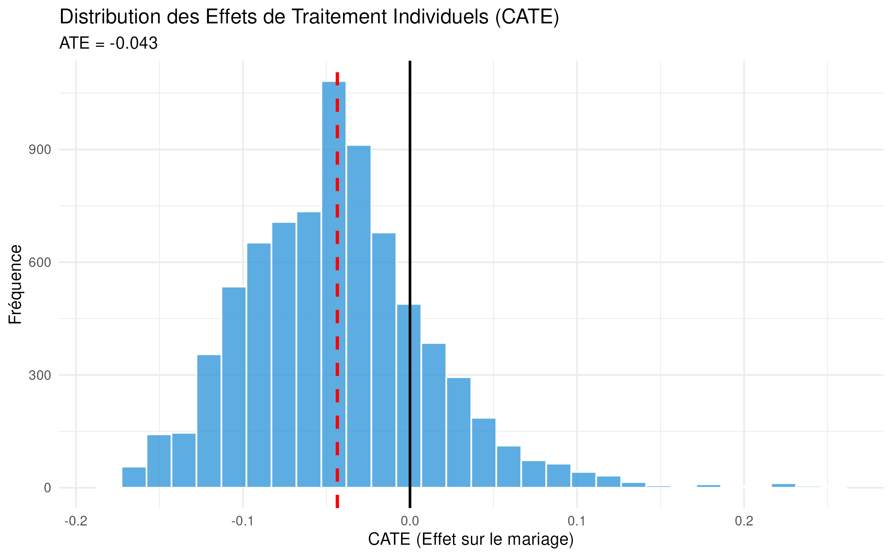

# Replication & Causal ML Extension: "A Signal to End Child Marriage" (AER, 2023)

[](https://www.ensae.fr)
[](https://www.r-project.org)
[](https://www.aeaweb.org/articles?id=10.1257/aer.20201066)
[]()

## Overview

This repository contains a **full replication** and **methodological extension** of:

> Buchmann, N., Field, E., Glennerster, R., Nazneen, S., & Wang, X. (2023). A Signal to End Child Marriage: Theory and Experimental Evidence from Bangladesh. *American Economic Review*, 113(10), 2645–2688.

The paper uses a randomized controlled trial (RCT) in rural Bangladesh to show that financial incentives tied to delayed marriage significantly reduce child marriage rates. This project first reproduces the paper's core experimental tables (**Step A**), then extends the analysis using **Causal Machine Learning** to uncover heterogeneous treatment effects and derive optimal targeting rules (**Step B**).

## Research Question

1. **Replication** — Do the original RCT estimates hold under independent replication? Can the main tables in Buchmann et al. (2023) be reproduced from the public data release?
2. **Extension** — Is the average treatment effect masking significant heterogeneity? Which subgroups of girls benefit most from financial incentives, and can we improve program efficiency through targeted rollout?

## Data

The raw data are publicly available through the **OpenICPSR** repository:

> OpenICPSR Project ID: **192114**

Download the data files and place them in a `data/` directory at the project root before running any scripts. The dataset covers girls in rural Bangladesh tracked across baseline and endline survey rounds, with variables on age, schooling status, household characteristics, and marriage outcomes.

## Methodology

### Step A — Replication (`src/replication/`)

| Script | Purpose |
|---|---|
| `src/replication/01_load_data.R` | Import and clean the OpenICPSR data release |
| `src/replication/02_replication_table2.R` | Reproduce Table 2 (ITT estimates on child marriage) via OLS/IV |
| `src/replication/04_comparative_table_arms.R` | Compare treatment arms (Incentive vs. Empowerment vs. Control) |
| `src/replication/04_visualization.R` | Reproduce key figures from the paper |

**Identification strategy:** Intention-to-Treat (ITT) exploiting random assignment across villages. Robustness checks include Difference-in-Differences specifications and heteroskedasticity-robust standard errors.

### Step B — Causal ML Extension (`src/heterogeneity-analysis/`)

| Script | Purpose |
|---|---|
| `src/heterogeneity-analysis/01_ml_prep.R` | Sub-sample to Incentive vs. Control arms; construct baseline covariate matrix |
| `src/heterogeneity-analysis/02_causal_forest.R` | Train a Causal Forest (GRF, 3,000 trees) to estimate individual-level CATEs |
| `src/heterogeneity-analysis/03_policy_analysis.R` | Derive optimal targeting rule; compute efficiency gain vs. universal rollout |

**Method:** Generalized Random Forests (Athey, Tibshirani & Wager, 2019) with honest estimation. Unconfoundedness is guaranteed by the RCT design. Missing covariates are mean-imputed prior to tree fitting.

## Key Results

### Step A — Average Treatment Effect

The main ITT results from Buchmann et al. (2023) are successfully reproduced: financial incentives reduce the probability of child marriage by approximately **4.9 percentage points** among the targeted population.

### Step B — Heterogeneous Treatment Effects

A Causal Forest trained on 3,000 trees reveals significant heterogeneity masked by the average effect:

| Metric | Result | Interpretation |
|---|---|---|
| **Global ATE (Forest)** | **−4.3 pp** | Consistent with OLS replication (−4.9 pp) |
| **Targeting Rule** | **Treat if CATE < 0** | Excludes ~19% of girls with null or negative response |
| **Optimal Target Size** | **81.06%** | The majority benefits, but not universally |
| **GATE (Targeted Group)** | **−6.28 pp** | Average effect on best-responding girls |
| **Efficiency Gain** | **+45.1%** | Impact per treated unit vs. universal rollout |

**Key insight:** Responders are predominantly girls currently enrolled in school at baseline. Targeting this subgroup would increase program impact per treated individual by **45%** relative to a universal rollout.



## Replication

```r
# 1. Clone the repository
# git clone https://github.com/VarnelT/replication-buchmann-aer2023.git

# 2. Download data from OpenICPSR (Project ID: 192114) and place in data/

# 3. Install required R packages
install.packages(c(
  "haven", "tidyverse", "estimatr", "fixest",
  "modelsummary", "gt", "glue", "scales",
  "grf", "caret"
))

# 4. Step A — run replication scripts in order
source("src/replication/01_load_data.R")
source("src/replication/02_replication_table2.R")
source("src/replication/04_comparative_table_arms.R")
source("src/replication/04_visualization.R")

# 5. Step B — run Causal ML scripts in order
source("src/heterogeneity-analysis/01_ml_prep.R")
source("src/heterogeneity-analysis/02_causal_forest.R")
source("src/heterogeneity-analysis/03_policy_analysis.R")
```

## References

- Buchmann, N., Field, E., Glennerster, R., Nazneen, S., & Wang, X. (2023). A Signal to End Child Marriage: Theory and Experimental Evidence from Bangladesh. *American Economic Review*, 113(10), 2645–2688.
- Athey, S., Tibshirani, J., & Wager, S. (2019). Generalized Random Forests. *The Annals of Statistics*, 47(2), 1148–1178.
- Chernozhukov, V., et al. (2018). Double/Debiased Machine Learning for Treatment and Structural Parameters. *The Econometrics Journal*, 21(1), C1–C68.

---

*Applied Econometrics & Causal Inference — ENSAE Paris*
